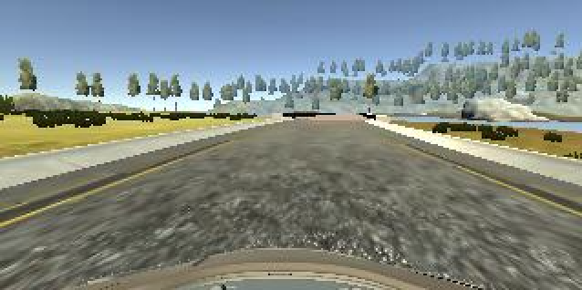
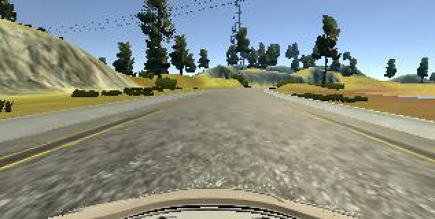
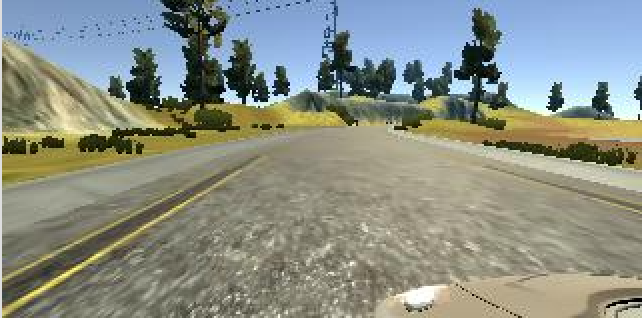
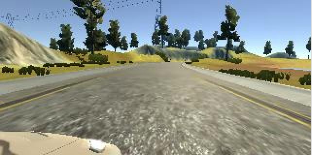
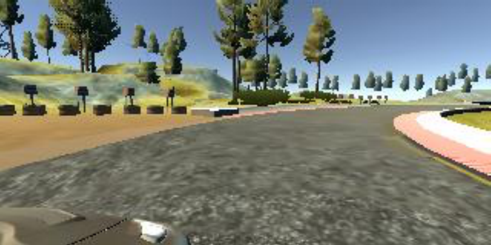
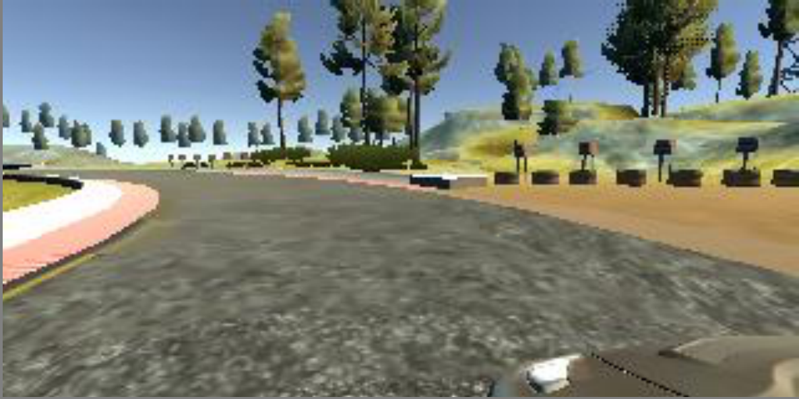

# **Behavioral Cloning**

---

**Behavioral Cloning Project**

The goals / steps of this project are the following:
* Use the simulator to collect data of good driving behavior
* Build, a convolution neural network in Keras that predicts steering angles from images
* Train and validate the model with a training and validation set
* Test that the model successfully drives around track one without leaving the road
* Summarize the results with a written report


[//]: # (Image References)

[image1]: ./examples/placeholder.png "Model Visualization"
[image2]: ./examples/placeholder.png "Grayscaling"
[image3]: ./examples/placeholder_small.png "Recovery Image"
[image4]: ./examples/placeholder_small.png "Recovery Image"
[image5]: ./examples/placeholder_small.png "Recovery Image"
[image6]: ./examples/placeholder_small.png "Normal Image"
[image7]: ./examples/placeholder_small.png "Flipped Image"

## Rubric Points
### Here I will consider the [rubric points](https://review.udacity.com/#!/rubrics/432/view) individually and describe how I addressed each point in my implementation.  

---
### Files Submitted & Code Quality

#### 1. Submission includes all required files and can be used to run the simulator in autonomous mode

My project includes the following files:
* model.py containing the script to create and train the model
* drive.py for driving the car in autonomous mode
* model.h5 containing a trained convolution neural network
* writeup_report.md or writeup_report.pdf summarizing the results

#### 2. Submission includes functional code
Using the Udacity provided simulator and my drive.py file, the car can be driven autonomously around the track by executing
```sh
python drive.py model.h5
```

#### 3. Submission code is usable and readable

The model.py file contains the code for training and saving the convolution neural network. The file shows the pipeline I used for training and validating the model, and it contains comments to explain how the code works.

### Model Architecture and Training Strategy

#### 1. An appropriate model architecture has been employed

My model consists of a convolution neural network with 5x5 and 3x3 filter sizes and depths between 24 and 64 (model.py lines 74-98)

The model includes RELU layers to introduce nonlinearity, and the data is normalized in the model using a Keras lambda layer (code line 76).

FC layers were implemented at the end of the model to perform the prediction.

#### 2. Attempts to reduce overfitting in the model

Subsample with the kernel size of 2x2 was used at convolutional layers to reduce the dimension and overfitting. (model.py lines 21).

The model was trained and validated on different data sets to ensure that the model was not overfitting (code line 130). The model was tested by running it through the simulator and ensuring that the vehicle could stay on the track.

#### 3. Model parameter tuning


The model used an adam optimizer, so the learning rate was not tuned manually (model.py line 128).

#### 4. Appropriate training data

Training data was chosen to keep the vehicle driving on the road. I used a combination of multi-cameras inputs from centre, left and right views. Data augmetation was also implemented by simply flipping the original camera image.

For details about how I created the training data, see the next section.

### Model Architecture and Training Strategy

#### 1. Solution Design Approach

The overall strategy for deriving a model architecture was to adjust parameters or training methods step by step with iterations of tests.

My first step was to use a one-layer convolution neural network model. It was used to build the total training and test pipeline. It is simply a developing/debugging framework without considering so much on the performance.

After the pipeline was evaluated, I started to improve the performance of the solution by updating the one-layer CNN architecture to the architecture of NAVIDIA End-to-End self-driving solution.

To gauge how well the model was working, I tried it with training data and validation data. It had a OK performance on normal road, but went off the road when the car moved on the bridge which has different surface.

To combat it, I double the training data by using data augmentation.

It showed some improvements. But the car often went to the edge of the road and could not go back to the centre line.

Three cameras data from left, right and center views was then involved as training data to train the model how to drive from the side to the center line of the road.

At the end of the process, the vehicle is able to drive autonomously around the track without leaving the road.

#### 2. Final Model Architecture
The final model architecture (model.py lines 74-98) consisted of a convolution neural network with the following layers and layer sizes:
```
____________________________________________________________________________________________________
Layer (type)                     Output Shape          Param #     Connected to                     
====================================================================================================
lambda_1 (Lambda)                (None, 160, 320, 3)   0           lambda_input_1[0][0]             
____________________________________________________________________________________________________
cropping2d_1 (Cropping2D)        (None, 65, 320, 3)    0           lambda_1[0][0]                   
____________________________________________________________________________________________________
convolution2d_1 (Convolution2D)  (None, 33, 160, 24)   1824        cropping2d_1[0][0]               
____________________________________________________________________________________________________
activation_1 (Activation)        (None, 33, 160, 24)   0           convolution2d_1[0][0]            
____________________________________________________________________________________________________
convolution2d_2 (Convolution2D)  (None, 17, 80, 36)    21636       activation_1[0][0]               
____________________________________________________________________________________________________
activation_2 (Activation)        (None, 17, 80, 36)    0           convolution2d_2[0][0]            
____________________________________________________________________________________________________
convolution2d_3 (Convolution2D)  (None, 9, 40, 48)     43248       activation_2[0][0]               
____________________________________________________________________________________________________
activation_3 (Activation)        (None, 9, 40, 48)     0           convolution2d_3[0][0]            
____________________________________________________________________________________________________
convolution2d_4 (Convolution2D)  (None, 5, 20, 64)     27712       activation_3[0][0]               
____________________________________________________________________________________________________
activation_4 (Activation)        (None, 5, 20, 64)     0           convolution2d_4[0][0]            
____________________________________________________________________________________________________
convolution2d_5 (Convolution2D)  (None, 3, 10, 64)     36928       activation_4[0][0]               
____________________________________________________________________________________________________
flatten_1 (Flatten)              (None, 1920)          0           convolution2d_5[0][0]            
____________________________________________________________________________________________________
activation_5 (Activation)        (None, 1920)          0           flatten_1[0][0]                  
____________________________________________________________________________________________________
dense_1 (Dense)                  (None, 100)           192100      activation_5[0][0]               
____________________________________________________________________________________________________
activation_6 (Activation)        (None, 100)           0           dense_1[0][0]                    
____________________________________________________________________________________________________
dense_2 (Dense)                  (None, 50)            5050        activation_6[0][0]               
____________________________________________________________________________________________________
activation_7 (Activation)        (None, 50)            0           dense_2[0][0]                    
____________________________________________________________________________________________________
dense_3 (Dense)                  (None, 10)            510         activation_7[0][0]               
____________________________________________________________________________________________________
activation_8 (Activation)        (None, 10)            0           dense_3[0][0]                    
____________________________________________________________________________________________________
dense_4 (Dense)                  (None, 1)             11          activation_8[0][0]               
====================================================================================================
Total params: 329,019
Trainable params: 329,019
Non-trainable params: 0
____________________________________________________________________________________________________
Train on 43394 samples, validate on 4822 samples
```

#### 3. Creation of the Training Set & Training Process

To capture good driving behaviour, I first recorded two laps on track one using center lane driving. Here is an example image of centre lane driving:


I then recorded the vehicle from the left side and right sides of the cameras so that I can get training data which shows how vehicle drives at the edge of the road. On the other hand, the training data became triple larger. Then, I added/subtracted constant value 0.2 as a steering angle to drive the vehicle back from the edge to the centre. The following images show what camera view looks like from centre, left, and right.

Centre View:

Left View:

Right View:


To augment the dataset, I also flipped images and angles thinking that this would a simplest way to double the size of training data.  For example, here is an right view image  that has then been flipped:

Original image:

Flipped image:


After the collection process, I had 43394 number of data points. I then preprocessed this data by cutting off the button part of the image which shows part of the vehicle. I added a Cropping2D layer to implement the ROI on the input images.

I finally randomly shuffled the data set and put 10% of the data into a validation set.

I used this training data for training the model. The validation set helped determine if the model was over or under fitting. The ideal number of epochs was 5 as evidenced by the validation result. I used an adam optimizer so that manually training the learning rate wasn't necessary.

Training process was logged as follows:
```
Epoch 1/7
43392/43394 [============================>.] - ETA: 0s - loss: 0.0186Epoch 00000: val_loss improved from inf to 0.01834, saving model to ./checkpoint/5_model_NAVIDIA_DA_ROI_MultiCameras/weights-00-0.02.h5
43394/43394 [==============================] - 70s - loss: 0.0186 - val_loss: 0.0183
Epoch 2/7
43392/43394 [============================>.] - ETA: 0s - loss: 0.0146Epoch 00001: val_loss improved from 0.01834 to 0.01613, saving model to ./checkpoint/5_model_NAVIDIA_DA_ROI_MultiCameras/weights-01-0.02.h5
43394/43394 [==============================] - 68s - loss: 0.0146 - val_loss: 0.0161
Epoch 3/7
43392/43394 [============================>.] - ETA: 0s - loss: 0.0113Epoch 00002: val_loss improved from 0.01613 to 0.01371, saving model to ./checkpoint/5_model_NAVIDIA_DA_ROI_MultiCameras/weights-02-0.01.h5
43394/43394 [==============================] - 69s - loss: 0.0113 - val_loss: 0.0137
Epoch 4/7
43392/43394 [============================>.] - ETA: 0s - loss: 0.0099Epoch 00003: val_loss improved from 0.01371 to 0.01348, saving model to ./checkpoint/5_model_NAVIDIA_DA_ROI_MultiCameras/weights-03-0.01.h5
43394/43394 [==============================] - 67s - loss: 0.0099 - val_loss: 0.0135
Epoch 5/7
43392/43394 [============================>.] - ETA: 0s - loss: 0.0092Epoch 00004: val_loss improved from 0.01348 to 0.01335, saving model to ./checkpoint/5_model_NAVIDIA_DA_ROI_MultiCameras/weights-04-0.01.h5
43394/43394 [==============================] - 67s - loss: 0.0092 - val_loss: 0.0133
Epoch 6/7
43392/43394 [============================>.] - ETA: 0s - loss: 0.0087Epoch 00005: val_loss did not improve
43394/43394 [==============================] - 66s - loss: 0.0087 - val_loss: 0.0136
Epoch 7/7
43392/43394 [============================>.] - ETA: 0s - loss: 0.0083Epoch 00006: val_loss did not improve
43394/43394 [==============================] - 67s - loss: 0.0083 - val_loss: 0.0135
```
